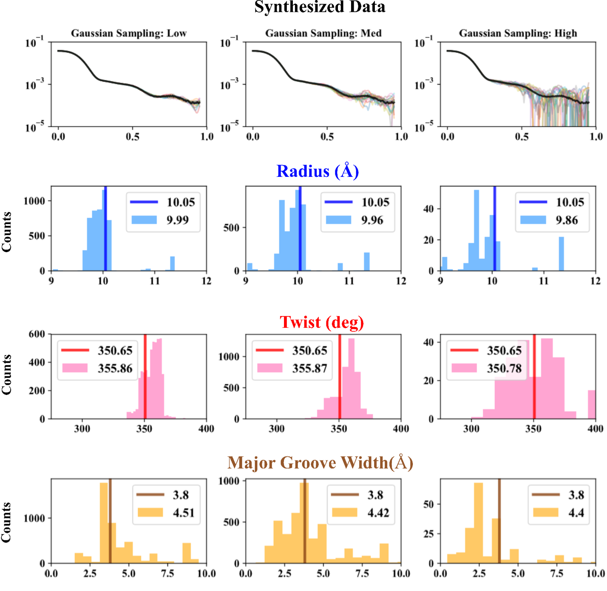
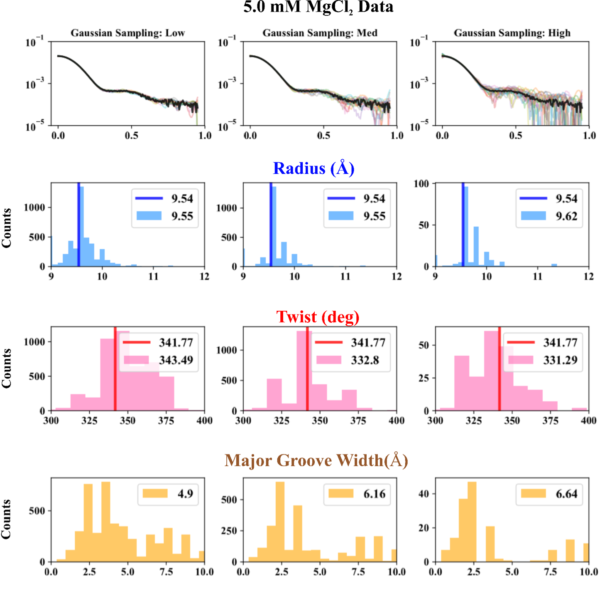
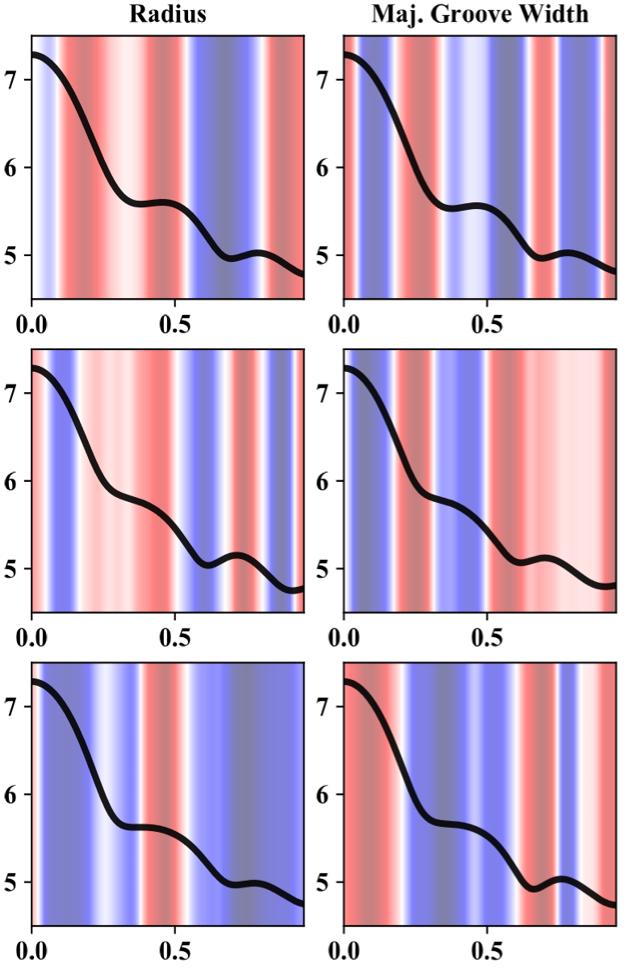

# MLWAXS
Machine Learning Approach for Bridging Solution X-ray Scattering Data and Molecular Dynamic Simulations on RNA

## Reference

This ML approach was submitted to IUCrJ and is under review.


## The Jupyter Notebook

Please refer to `WAXS-XGBoost-Radius-Training.ipynb` in this repo for the notebook mentioned in our manuscript. If Github has trouble parsing the notebook, try either download it or view the `WAXS-XGBoost-Radius-Training.pdf`. 


## Required Libraries

1. xgboost (version: 0.9.0)
2. numpy (version: 1.16.4)
3. scikit-learn
4. pickle
5. h5py (version: 2.9.0)


## Additional Scripts

1. Testing the linear models (linear regression, ridge regression and LASSO): `linear_radius.py`
2. Exploring the Shannon sampling limit and noise effects: `xgb_radius_sampling_noise.py`


## Note

1. If you find it useful, please cite the paper. Thanks.
2. The following is just "garbage collection".


---
## Misc Notes

1. I also tried 1D convolutional neural network (CNN), which also worked but not as simple and interpretable as the xgboost models. The CNN approach was presented at Biophysical Society Meeting 2020 in San Diego and you can find [the abstract here](https://doi.org/10.1016/j.bpj.2019.11.1706).
2. The CNN models were implemented in (a) Python using `keras` with `tensorflow` backend and (b) Julia using `Mocha.jl`, which has migrated to `MXNet.jl` or `Flux.jl`.


---
---
# CNNWAXS (Python)
Convolutional Neural Network (CNN) Approach for Solution X-ray Scattering Data


## Prerequisite

1. keras with Tensorflow backend (version: 2.2.4)
2. pickle
3. numpy (version: 1.16.4)
4. h5py (version: 2.9.0)


## Running

1. Setting up the function `convolutional_neural_nets` and `train_model` by running

```python
runfile('/my/path/to/training.py', wdir='/my/path/to')
```

   And keras should tell you:

```
Using TensorFlow Backend
```

2. Setting up the convolutional neural network by running

```python
model = convolutional_neural_nets()
```

  One should see the structure of the network as the following.

```
_________________________________________________________________
Layer (type)                 Output Shape              Param #   
=================================================================
conv1d_1 (Conv1D)            (None, 191, 128)          1408      
_________________________________________________________________
activation_1 (Activation)    (None, 191, 128)          0         
_________________________________________________________________
dropout_1 (Dropout)          (None, 191, 128)          0         
_________________________________________________________________
max_pooling1d_1 (MaxPooling1 (None, 92, 128)           0         
_________________________________________________________________
conv1d_2 (Conv1D)            (None, 92, 128)           163968    
_________________________________________________________________
dropout_2 (Dropout)          (None, 92, 128)           0         
_________________________________________________________________
max_pooling1d_2 (MaxPooling1 (None, 43, 128)           0         
_________________________________________________________________
conv1d_3 (Conv1D)            (None, 43, 128)           163968    
_________________________________________________________________
dropout_3 (Dropout)          (None, 43, 128)           0         
_________________________________________________________________
max_pooling1d_3 (MaxPooling1 (None, 18, 128)           0         
_________________________________________________________________
flatten_1 (Flatten)          (None, 2304)              0         
_________________________________________________________________
dense_1 (Dense)              (None, 1024)              2360320   
_________________________________________________________________
batch_normalization_1 (Batch (None, 1024)              4096      
_________________________________________________________________
dense_2 (Dense)              (None, 256)               262400    
_________________________________________________________________
dropout_4 (Dropout)          (None, 256)               0         
_________________________________________________________________
dense_3 (Dense)              (None, 64)                16448     
_________________________________________________________________
dropout_5 (Dropout)          (None, 64)                0         
_________________________________________________________________
dense_4 (Dense)              (None, 25)                1625      
=================================================================
Total params: 2,974,233
Trainable params: 2,972,185
Non-trainable params: 2,048
_________________________________________________________________
```

  Alternatively, you can print this out by typing:

```python
model.summary()
```

  One can change the `indim`, `outdim`, `n_filters`, `conv_kernel`, `conv_stride`, `pool_kernel` and `pool_stride` to try it out for your problem of interest.


3. Training

  Use the function `train_model` and input the training data. See the file `training_script.py` for details.

  Once the training begins, the interface looks like the following:

```
...
43235/43235 [==============================] - 0s 63ms/step - loss: 0.4817 - acc: 0.7708
Epoch 147/2500
43235/43235 [==============================] - 0s 64ms/step - loss: 0.4764 - acc: 0.7747
Epoch 148/2500
...
```

  The hyper-parameters at the training stage are: `learning_rate`, `batch_size` and `n_epochs` but are not restricted to these. The hyper-parameter tuning is difficult for some problems.

  The trained model will be saved as `*_model_yyyymmdd.h5` file for further analysis and testing.

4. Load model

  To load your trained model, run

```python
from keras.models import load_model
model = load_model("*_model_yyyymmdd.h5")
```

## Results 

These plots were in my BPS2020 poster. 

1. CNN structure


2. Training History and Performances


3. Validation on Sythesized data



4. On experimental data



5. First CNN layer output (feature importance/information)




## Notes

1. Please check out the documentation of keras for more detailed information
2. The structure of neural network might depend on different problems
3. The following is another "garbage collection".


---
# Generalized CNN (Julia, version: 0.6.4)
Generalized Convolutional Neural Net for Solution X-ray Scattering Data

## TBH

1. I was being too, over, ambitious.
2. I didn't have enough computing resources at Cornell, but the data prep is done ~ 2T.
3. There is a nice work that "sort of" shares the same idea: [Model Reconstruction from Small-Angle X-Ray Scattering Data Using Deep Learning Methods](https://doi.org/10.1016/j.isci.2020.100906)

## Prerequisite

1. `Mocha.jl` (now `MXNet.jl` or `Flux.jl`)
2. `CLArray.jl` (now `CuArray.jl` or `GPUArray.jl`)
3. `Dierckx.jl`

## Notes

1. The file `networks.jl` contains the CNN models and the feed-forward models.
2. The file `dq.jl` has been integrated to my other packages: `SWAXS.jl` (private) and `SWAXS` (binary).
3. Special thanks to Princeton CS group
